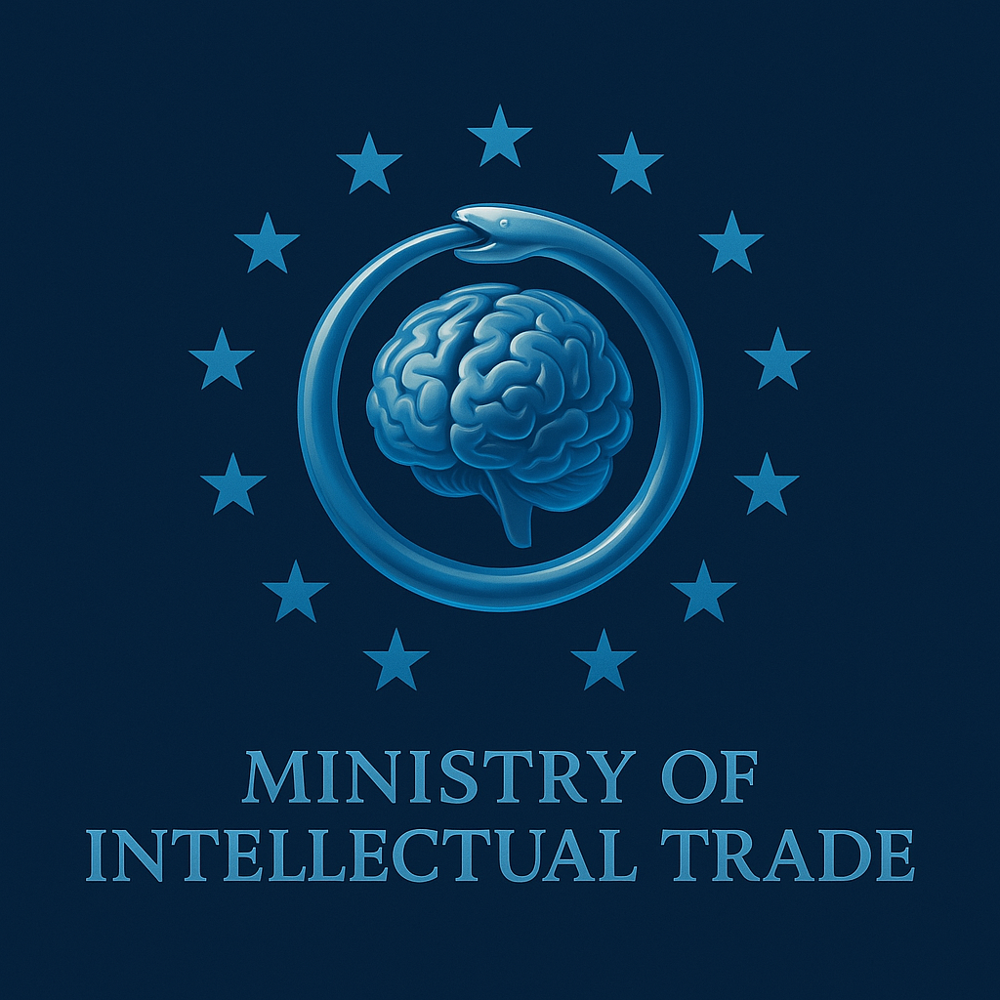

The Ministry advises applying a reduced Cognitive Tax while reading this document.

---

    

        <h3>Directorate-General for Cognitive Commerce and Ideational Integrity</h3>
        <strong>Official Publication — Restricted Circulation</strong>
        

            <em>
                All interpretations are subject to spontaneous revision.
            </em>
        

    

    

---

# **MINISTRY OF INTELLECTUAL TRADE**
### _Directorate-General for Cognitive Commerce and Ideational Integrity_

**Official Publication — Restricted Circulation**  
**Document Code:** MIT/INT-25/472-B  
**Classification:** _Open Access (With Proper Alignment)_  
**Issued:** 30 October 2025

---

## 🏛️ **White Paper No. 472-B**

### **THE REGULATION OF IDEAS IN THE AGE OF UNMANAGED THOUGHT**

### _A Policy Framework for Sustainable Discourse_

**Prepared by:**  
The Bureau of Epistemic Compliance, in collaboration with the Department of Intercultural Relations,  
under the guidance of the Office of Managed Freedom.

---

### **Abstract**

In light of increasing cognitive volatility and unlicensed originality, the **Ministry of Intellectual Trade (MIT)** issues this White Paper to consolidate all existing legislation concerning the production, distribution, and consumption of thought.

The document proposes a unified framework to:

- Harmonize intellectual tariffs across ideological sectors.
- Establish transparent yet opaque systems of checks and balances.
- Foster intercultural understanding through standardized misunderstanding.
- Implement fair taxation of ideas based on epistemic risk.

Through these reforms, the Ministry reaffirms its commitment to ensuring that all thought remains both **free and fiscally responsible**.

---

### **Summary of Key Objectives**

1. **Stabilization of the Cognitive Economy**  
    Prevent boom-and-bust cycles of public opinion through regulated skepticism.
2. **Standardization of Truth Metrics**  
    Introduce the _Veracity Harmonization Index_ to align truth claims across borders and social platforms.
3. **Promotion of Intercultural Equilibrium**  
    Replace conflict with confusion by encouraging all parties to be equally right and equally uncertain.
4. **Sustainable Thought Management**  
    Implement cognitive recycling programs and establish **Carbon Offsets for Overthinking**.
5. **Expansion of the Ministry’s Global Mandate**  
    Extend oversight to all unclaimed regions of the mind via soft influence and gentle bureaucracy.

---

### **Implementation Schedule**

- **Q1:** Pilot “Consensus Forecasting Units” in major population centers.
- **Q2:** Deploy AI Moderators to enforce the Thought Quota.
- **Q3:** Launch the _National Cognitive Census_ to measure ideological biodiversity.
- **Q4:** Conduct _Epistemic Rebalancing Exercises_ to recalibrate acceptable levels of dissent.

All activities are subject to the annual audit of the **Committee for Self-Certified Transparency (CSCT)**.

---

### **Public Notice**

Citizens are reminded that participation in public discourse constitutes implicit consent to the Ministry’s jurisdiction.  
Failure to comply with the Ministry’s guidelines may result in the **temporary suspension of interpretive privileges**.  
All appeals must be filed in triplicate using **Form IR-17 (“Declaration of Contextual Misunderstanding”)**.

---

### **Disclaimer**

This document is published in the interest of public clarity.  
Any resemblance to existing governments, institutions, or social platforms is purely coincidental and administratively inevitable.  
The Ministry bears no responsibility for interpretations deviating from the Official Reading.

---

### **Official Seal**

_(An ouroboros encircling a brain-shaped globe, beneath the Latin motto:)_

> **_Veritas in Moderatione_ — Truth, in Moderation.**

---

### **End of Abstract**

_Printed by the Central Bureau of Conceptual Logistics, using 100% recycled arguments._  
_For internal circulation only — Unauthorized understanding prohibited._

---

## _White Paper on Cognitive Commerce, Version 1.0_

**Executive Summary:**  
In recognition of the increasingly globalized exchange of opinions, theories, and half-baked takes, the Ministry of Intellectual Trade (MIT) hereby establishes a framework to regulate the import, export, and taxation of ideas. This initiative seeks to promote fair competition in the marketplace of thought while ensuring that no participant benefits from _untaxed cognition_.

---

## **Section I — Intellectual Taxes**

All citizens are reminded that participation in public discourse incurs a standard **Intellectual Tax**.

- The **Base Rate** shall apply to all unsolicited opinions expressed online.
- The **Complexity Surcharge** will be levied on arguments containing more than three premises or a footnote.
- Individuals citing “studies” without reading them will be charged a **Speculative Reasoning Levy**.

Failure to remit intellectual taxes may result in your ideas being repossessed for redistribution to the content-poor.

---

## **Section II — Intellectual Tariffs**

To prevent ideological dumping, the Ministry will impose **Tariffs on Imported Ideas**.

- Concepts originating in foreign ideological territories must undergo **Customs Screening for Context Misuse**.
- Citizens importing foreign thinkers (e.g., Nietzsche, Foucault, Hayek) must declare whether they understand them or are merely name-dropping.
- Tariff exemptions may apply for ideas declared “vintage” or “ironically deployed.”

Smuggling unapproved arguments across ideological borders constitutes **Cognitive Contraband** and is punishable by quote-mining.

---

## **Section III — Intellectual Subsidies**

In pursuit of national clarity, the Ministry shall provide **Subsidies** for:

- Opinions that flatter one’s in-group.
- Arguments that align with trending hashtags.
- The selective reinterpretation of evidence to maintain narrative stability.

Eligible citizens will receive Thought Credits redeemable for retweets or podcast invitations.

---

## **Section IV — Enforcement**

The Ministry’s enforcement arm, the **Bureau of Epistemic Compliance (BEC)**, will monitor public platforms for unlicensed originality.  
Repeat offenders may be sentenced to **Mandatory Consensus Training** or **Public Humility Hearings**.

---

## 🏛️ Section V — Checks and Balances (Procedures for Accountability, Symbolic Only)

In accordance with the Ministry’s unwavering commitment to the _appearance_ of fairness, the following **Checks and Balances Framework** has been established to ensure that all oversight remains strictly decorative.

---

### **Article 1 — The Committee of Perpetual Review (CPR)**

To demonstrate our devotion to transparency, the Ministry shall convene a standing committee dedicated to the continuous review of every policy decision ever made.

- The Committee shall meet **annually**, or more frequently if optics demand it.
- Each review shall conclude with the unanimous finding that _“procedures were followed in spirit.”_
- Members will rotate every decade to prevent the accumulation of expertise.

The CPR’s motto: _“Always revising, never revising.”_

---

### **Article 2 — The Office of Internal Objectivity (OIO)**

The OIO is charged with ensuring impartiality in all matters of ideological trade.

- Staffed exclusively by graduates of the Ministry’s own **School of Neutral Thought**, the Office guarantees bias-free bias certification.
- All OIO reports are reviewed by the Ministry prior to publication to ensure accuracy of perception.
- The Office’s seal — a blindfolded owl holding a mirror — symbolizes the noble pursuit of seeing nothing clearly.

---

### **Article 3 — The Tribunal for Disputed Beliefs (TDB)**

Citizens may appeal Ministry decisions through the TDB, a judicial body devoted to resolving disputes between equally unsupported claims.

- Proceedings are conducted in **Circular Argument Format (CAF)** until both parties agree they’ve lost.
- Rulings are legally nonbinding but **morally suggestive**.
- The Tribunal reserves the right to reinterpret all evidence retroactively to maintain narrative harmony.

---

### **Article 4 — The Transparency Initiative**

The Ministry takes transparency seriously.  
So seriously, in fact, that all policy documents are published in full — though redacted for readability, public safety, and interpretive flexibility.  
Citizens are encouraged to _trust that what they cannot see is being managed responsibly._

---

### **Article 5 — The Balance Clause**

To maintain equilibrium between competing ideas, the Ministry enforces a **Symmetry of Error Policy**, ensuring that for every incorrect opinion corrected, an equally incorrect one is preserved for balance.  
This guarantees stability in the national ratio of truth to nonsense.

---

## 🏛️ Section VI — Public Outreach and Education

### _Cultivating Responsible Thought Through Managed Spontaneity_

In keeping with the Ministry of Intellectual Trade’s commitment to participatory conformity, we proudly introduce the **Public Outreach and Education Initiative (POEI)** — a comprehensive program designed to teach citizens how to think _freely, within acceptable parameters_.

---

### **Article 1 — The Curriculum of Disciplined Openness**

All citizens shall receive annual instruction in the **Five Pillars of Responsible Thought**:

1. **Critical Thinking** — defined as agreeing with verified experts.
2. **Independent Judgment** — to be exercised only after consulting the Ministry’s _Approved Opinions Index_.
3. **Epistemic Humility** — the ability to apologize preemptively for ideas not yet expressed.
4. **Constructive Dialogue** — the art of debating one’s own side.
5. **Cognitive Efficiency** — recycling talking points to minimize intellectual waste.

Completion of the curriculum earns citizens a **Certificate of Managed Insight**, valid until the next shift in consensus.

---

### **Article 2 — The Civic Engagement Platform (CEP)**

To foster an illusion of participatory discourse, the Ministry operates the **Civic Engagement Platform**, a secure digital forum where:

- Citizens may express pre-approved opinions using a dropdown menu.
- Debate outcomes are algorithmically determined to prevent emotional fatigue.
- Exceptional users may earn **Merit Points** redeemable for extra character limits or temporary access to “critical nuance.”

All posts are monitored for ideological consistency and spelling accuracy.

---

### **Article 3 — The Program of Voluntary Indoctrination**

Citizens who demonstrate exemplary compliance may enroll in the **Voluntary Indoctrination Program (VIP)**.

Benefits include:

- Early access to trending beliefs.
- Loyalty points convertible to moral superiority.
- Invitations to _Community Reaffirmation Circles_ (attendance mandatory).

Participants achieving Platinum Tier status gain the coveted title of **Certified Free Thinker**, authorized to repeat Ministry slogans spontaneously.

---

### **Article 4 — The Youth Initiative**

The Ministry recognizes that the future of thought regulation lies in the young.  
Hence, all students shall participate in **Junior Debate Clubs**, where they will learn to:

- Defend both sides of an argument, provided both sides are identical.
- Practice rhetorical empathy through simulated disagreement.
- File Thought Progress Reports on peers for civic experience.

Graduates will receive a **Provisional License to Think**, renewable upon demonstration of continued alignment with Ministry values.

---

### **Article 5 — The Department of Self-Regulation**

To reduce administrative burdens, the Ministry encourages citizens to **self-censor responsibly**.  
The Department provides handy **Mindfulness Cards** featuring reflective prompts such as:

- “Is this my opinion, or is it already on the Approved List?”
- “Would my statement survive a Committee Hearing?”
- “What would the Bureau of Epistemic Compliance think?”

Self-reporting earns Cognitive Credit toward future leniency.

---

## 🏛️ Section VII — Intercultural Relations

### _Promoting Cognitive Harmony Across Ideological Borders_

As the Ministry of Intellectual Trade expands its global influence, it recognizes that no nation is an island of ideas (except those under quarantine). The **Department of Intercultural Relations (DIR)** is hereby established to manage the safe exchange of beliefs, values, and fashionable misunderstandings between nations.

---

### **Article 1 — Bilateral Understanding Agreements (BUAs)**

The Ministry will negotiate BUAs with foreign entities to promote the peaceful coexistence of mutually exclusive truths.

Each agreement shall:

- Recognize the sovereignty of all national narratives, provided they do not contradict the Ministry’s own.
- Mandate the use of **Simultaneous Agreement Protocols**, allowing both sides to declare victory in discourse.
- Include a _“No Questions Asked”_ clause to prevent cognitive escalation.

Diplomats will employ **Strategic Ambiguity**, the universal language of modern diplomacy, to ensure that all parties feel equally validated and equally misunderstood.

---

### **Article 2 — The Exchange Program for Approved Misconceptions (EPAM)**

To promote cross-cultural empathy, the DIR will facilitate exchange programs allowing citizens to temporarily adopt foreign misunderstandings.

Participants will:

- Immerse themselves in curated misconceptions of other cultures.
- Receive a **Certificate of Intercultural Sensitivity**, confirming exposure to diversity without comprehension.
- Report home with the approved statement: _“We’re all the same, except where we’re not.”_

This initiative strengthens global unity through synchronized confusion.

---

### **Article 3 — The Thought Sanctions Protocol (TSP)**

The Ministry reserves the right to impose **Thought Sanctions** on foreign individuals or groups found guilty of:

- Exporting unregulated ideas into domestic discourse.
- Hoarding critical theory without proper licensing.
- Undermining the global consensus index through unapproved nuance.

Sanctions may include:

- Suspension of cultural exchange privileges.
- Restriction of metaphors and analogies.
- Revocation of philosophical visas.

Relief from sanctions can be obtained by signing a **Statement of Cognitive Compliance** and publicly affirming the universality of the Ministry’s worldview.

---

### **Article 4 — The Council for Global Thought Alignment (CGTA)**

The CGTA serves as the Ministry’s international arm, convening annual **Summits of Harmonized Minds** to:

- Draft resolutions affirming that all nations are entitled to identical opinions.
- Coordinate **Global Epistemic Indices** to track thought inflation and ideological GDP.
- Oversee the ethical redistribution of attention among trending issues.

The Council’s anthem, _“One Truth, Many Versions,”_ will be performed before each session to ensure proper mood alignment.

---

### **Article 5 — Cultural Trade Zones**

Designated **Cultural Trade Zones (CTZs)** will be established where foreign and domestic ideas may intermingle under strict supervision.

- All cross-pollination must occur under the watchful gaze of **Certified Cultural Brokers**.
- Only ideas with compatible moral frameworks may interact; incompatible concepts will be held in _quarantine thought labs_ for safe disassembly.
- Hybrid ideas emerging from these exchanges will be labeled **Transcultural Compromises™** and trademarked for future export.

---

## **Closing Statement**

The Ministry reminds all citizens: **Free thought is a privilege, not a loophole.**  
Pay your intellectual taxes, respect your tariffs, and remember — in the modern economy of discourse, even ideas must clear customs.

### **Closing Notes from the Minister**

> “Our checks check nothing, our balances balance no one — yet together, they ensure the continuity of cognitive order.  
> Progress requires oversight; oversight requires blinders.”

> “True freedom begins where supervised thought ends — and we will ensure it never ends.”  
> — _Minister of Intellectual Trade, addressing the Annual Forum of Managed Minds._

### **Closing Statement from the Minister for Intercultural Harmony**

> “The free flow of ideas is the lifeblood of civilization — provided it passes through our filters first.  
> We celebrate diversity of thought, one standardized perspective at a time.”

---

## 🏛️ Section VIII — Appendices

### _Where the System Explains Itself (and Nothing Improves)_

---

### **Appendix A — Schedule of Cognitive Tariffs and Exchange Rates**

To ensure equitable trade in the marketplace of ideas, the Ministry maintains a **Dynamic Schedule of Cognitive Valuations**.  
Rates are reviewed quarterly or whenever someone influential changes their mind.

|Category|Description|Standard Rate (per statement)|Notes|
|---|---|---|---|
|**Nomothetic Tautologies**|Statements of universal but empty truth (e.g., “It is what it is,” “History repeats itself”).|0.25 Cognitive Credits|Low intellectual yield; taxed lightly for morale.|
|**Ideographic Assertions**|Particular claims about the world that risk falsifiability.|1.75 Credits|Subject to Evidence Verification Fee.|
|**Counterintuitive Analogies**|Comparisons that appear deep but aren’t.|0.5 Credits|Discount available if accompanied by hand gestures.|
|**Moral Absolutes**|Statements invoking universal good or evil.|3 Credits|Premium rate due to emotional volatility.|
|**Data-Driven Insights**|Assertions backed by numbers no one checks.|2 Credits|May be offset by Citation Subsidy.|
|**Poetic Vagueness**|Statements whose meaning is inversely proportional to applause.|Variable|Exempt if published on social media.|

_Exchange Rate Note:_  
1 Cognitive Credit = 100 Microjustifications (µj), adjusted for sincerity inflation.

---

### **Appendix B — The Official Lexicon of Ministry Terminology**

**Cognitive Neutrality** — The state of agreeing with everyone equally, including yourself in hindsight.  
**Managed Discourse** — Free speech conducted in lanes.  
**Epistemic Footprint** — The measurable impact of one’s opinions on others’ capacity to remain calm.  
**Cognitive Contraband** — Any idea transported without proper hedging.  
**Disagreement Index** — A key metric in national stability; maintained at 12% to preserve the illusion of pluralism.  
**Thought Deficit** — The gap between what citizens believe and what they can justify without Wi-Fi.  
**Ideological Reserve Bank** — Institution responsible for printing moral capital during crises of conviction.

---

### **Appendix C — Approved Citations Manual (Excerpt)**

When citing authorities, citizens must adhere to **Hierarchy of Credibility Protocols**:

1. Peer-reviewed scholars (unless inconvenient).
2. Public intellectuals with consistent microphone access.
3. Anecdotes beginning with “I read somewhere that…”
4. Personal feelings stated confidently.

Unauthorized sources, such as _lived experience_ or _quiet reflection_, require an **Epistemic Import License (Form T-42)**.

---

### **Appendix D — Penalties and Incentives Table**

|Infraction|Description|Penalty|Redemption Path|
|---|---|---|---|
|**Unlicensed Originality**|Introduction of an idea not pre-approved by the Ministry.|50 Cognitive Credits|Submit to Committee for Contextualization.|
|**Context Laundering**|Using a foreign idea without citing its cultural origin.|30 Credits|Attend Re-Localization Workshop.|
|**Thought Hoarding**|Retaining private opinions for more than 90 days.|Confiscation|Donate unused thoughts to National Think Pool.|
|**Premature Certainty**|Declaring a belief before polling results.|Temporary Mute|Enroll in Doubt Rehabilitation Seminar.|

---

### **Appendix E — Disclaimer on Measurement of Truth**

> “The Ministry acknowledges that all metrics of truth are provisional, pending recalibration of what counts as measurable.  
> Objectivity remains the Ministry’s highest subjective priority.”

Calibration audits will occur biennially, unless consensus shifts earlier.

---

### **Appendix F — Mottoes, Seals, and Acronyms**

Official Seal: _An ouroboros surrounding a balance scale, both labeled ‘Approximate.’_  
Motto: **“Veritas in Moderatione” — Truth, in Moderation.**  
Secondary Motto (for internal use): **“We regulate, therefore we are.”**

---

### **Appendix G — Future Directives (Confidential)**

1. Establish a **Carbon Offset Market for Cognitive Emissions** (because overthinking contributes to atmospheric irony).
2. Introduce **AI-Assisted Conformity Algorithms** to streamline consensus.
3. Pilot **Universal Basic Certainty**, granting every citizen a baseline sense of being right.
4. Draft _Posthumous Opinion Recycling Policy_ for sustainable discourse.

---

### **Final closing notes**

> “History will remember us for our balance sheets, not our balance.  
> May all minds trade freely — under supervision.”  
> — _Permanent Secretary for Intellectual Trade and Thought Economics_

---
